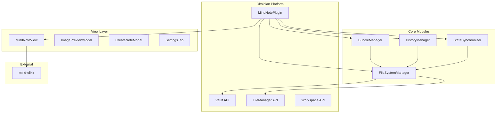
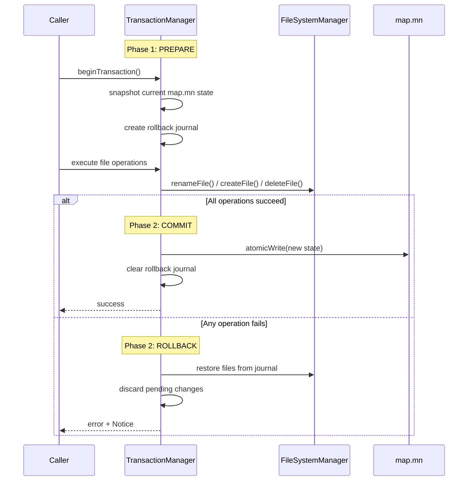
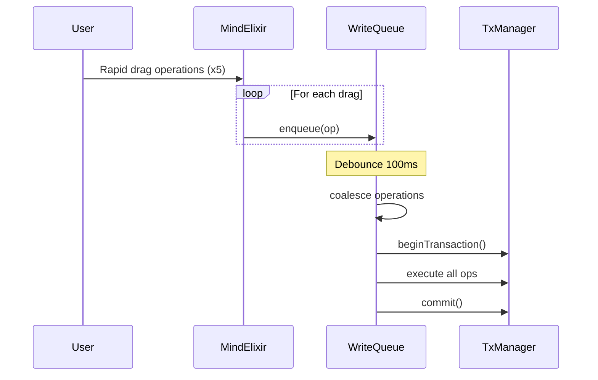
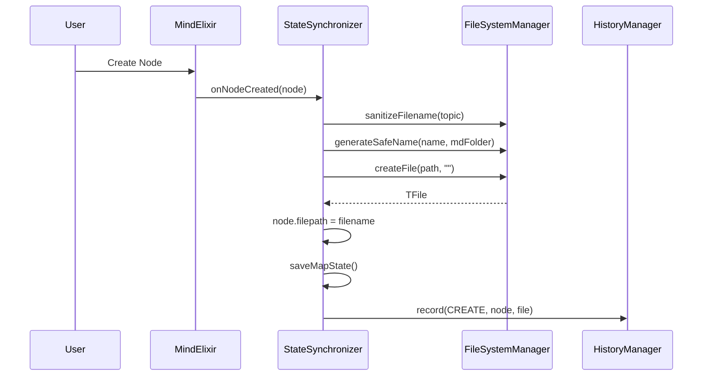
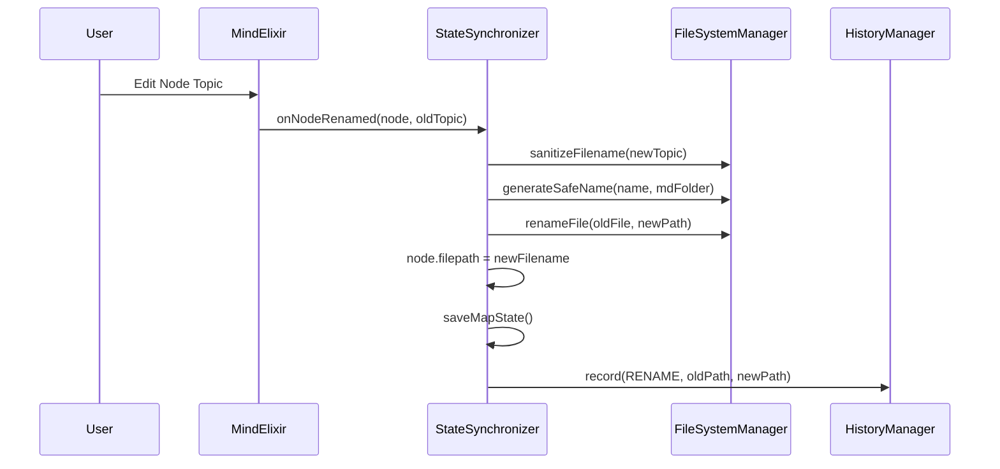
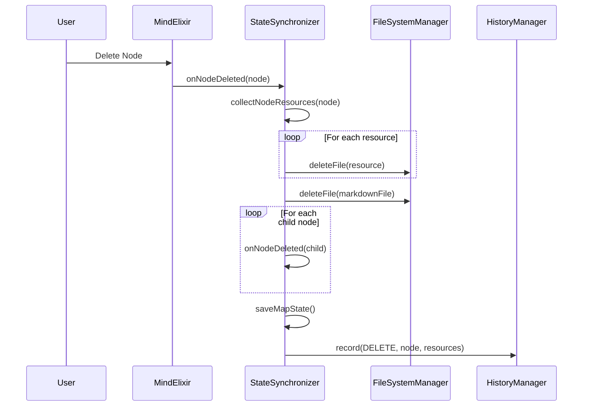

# MindNote Plugin Architecture

## System Overview



---

## Module Architecture

### 1. FileSystemManager

> **✅ RESOLVED**: Error handling uses Obsidian `Notice` API for notifications.

Manages all file operations using Obsidian's Vault API and Adapter.
> **⚠️ CRITICAL CONSTRAINT**: Direct use of Node.js `fs` module is **STRICTLY PROHIBITED**. All file I/O must go through `app.vault` or `app.vault.adapter`.

#### Atomic Operation Protocol

```typescript
interface FileSystemManager {
  // Atomic Operations (using Vault.process())
  atomicRead(file: TFile): Promise<string>;
  atomicWrite(file: TFile, transform: (content: string) => string): Promise<void>;
  
  // Directory Operations
  createDirectory(path: string): Promise<TFolder>;
  ensureDirectory(path: string): Promise<TFolder>;
  
  // File Operations
  createFile(path: string, content: string): Promise<TFile>;
  renameFile(file: TFile, newPath: string): Promise<void>;
  deleteFile(file: TFile): Promise<void>;
  copyFile(source: TFile, destPath: string): Promise<TFile>;
  
  // Resource Management
  saveImage(bundlePath: string, data: ArrayBuffer, name: string): Promise<string>;
  saveResource(bundlePath: string, data: ArrayBuffer, name: string, ext: string): Promise<string>;
  
  // Query Operations
  exists(path: string): Promise<boolean>;
  getAbstractFile(path: string): TAbstractFile | null;
  listFiles(folder: TFolder): TFile[];
  
  // Utility
  generateSafeName(baseName: string, folder: TFolder): string;
  sanitizeFilename(name: string): string;
}
```

#### Implementation Details

```typescript
class FileSystemManagerImpl implements FileSystemManager {
  constructor(private app: App) {}
  
  /**
   * Atomic write using Vault.process() to prevent conflicts
   * @param file Target file
   * @param transform Function to transform content
   */
  async atomicWrite(file: TFile, transform: (content: string) => string): Promise<void> {
    await this.app.vault.process(file, transform);
  }
  
  /**
   * Sanitize filename by replacing illegal characters
   * Illegal chars: \ / : * ? " < > |
   */
  sanitizeFilename(name: string): string {
    return name.replace(/[\\/:*?"<>|]/g, '_').trim();
  }
  
  /**
   * Generate unique filename by appending _1, _2, etc.
   * MUST be used for both:
   * 1. Creating new files (collision with existing)
   * 2. Renaming files (collision with target)
   */
  generateSafeName(baseName: string, folder: TFolder): string {
    const sanitized = this.sanitizeFilename(baseName);
    let candidate = sanitized;
    let counter = 1;
    
    while (this.exists(normalizePath(`${folder.path}/${candidate}.md`))) {
      candidate = `${sanitized}_${counter}`;
      counter++;
    }
    
    return candidate;
  }
  
  /**
   * Delete file using FileManager for proper cleanup
   */
  async deleteFile(file: TFile): Promise<void> {
    await this.app.fileManager.trashFile(file);
  }
}
```

#### Unit Test Coverage

| Test Case | Description |
|-----------|-------------|
| `test_sanitizeFilename_replacesIllegalChars` | Verifies all illegal characters replaced |
| `test_sanitizeFilename_preservesValidChars` | Verifies valid characters preserved |
| `test_generateSafeName_uniqueness` | Verifies counter increment for duplicates |
| `test_atomicWrite_concurrentAccess` | Verifies no data loss under concurrent writes |
| `test_createDirectory_nested` | Verifies nested directory creation |
| `test_deleteFile_usesTrash` | Verifies FileManager.trashFile() usage |

---

### 1.1 TransactionManager (2-Phase Commit)

Ensures atomic operations with rollback capability when file operations fail.

#### 2-Phase Commit Protocol



#### Implementation

```typescript
interface TransactionContext {
  id: string;
  mapSnapshot: string;           // JSON snapshot before changes
  fileOperations: FileOperation[];
  status: 'pending' | 'committed' | 'rolledback';
}

interface FileOperation {
  type: 'create' | 'rename' | 'delete';
  originalPath?: string;
  newPath?: string;
  originalContent?: string;      // For rollback of deleted files
}

class TransactionManager {
  private currentTx: TransactionContext | null = null;
  
  async beginTransaction(): Promise<string> {
    const mapFile = this.getMapFile();
    const snapshot = await this.app.vault.read(mapFile);
    
    this.currentTx = {
      id: crypto.randomUUID(),
      mapSnapshot: snapshot,
      fileOperations: [],
      status: 'pending'
    };
    return this.currentTx.id;
  }
  
  recordOperation(op: FileOperation): void {
    if (!this.currentTx) throw new Error('No active transaction');
    this.currentTx.fileOperations.push(op);
  }
  
  async commit(newMapState: MindMapData): Promise<void> {
    if (!this.currentTx) throw new Error('No active transaction');
    
    try {
      const mapFile = this.getMapFile();
      await this.app.vault.modify(mapFile, JSON.stringify(newMapState, null, 2));
      this.currentTx.status = 'committed';
    } catch (error) {
      await this.rollback();
      throw error;
    } finally {
      this.currentTx = null;
    }
  }
  
  async rollback(): Promise<void> {
    if (!this.currentTx) return;
    
    // Reverse operations in LIFO order
    const ops = [...this.currentTx.fileOperations].reverse();
    
    for (const op of ops) {
      switch (op.type) {
        case 'create':
          // Delete the created file
          const created = this.app.vault.getAbstractFileByPath(op.newPath!);
          if (created instanceof TFile) await this.app.vault.delete(created);
          break;
        case 'rename':
          // Rename back to original
          const renamed = this.app.vault.getAbstractFileByPath(op.newPath!);
          if (renamed instanceof TFile) {
            await this.app.fileManager.renameFile(renamed, op.originalPath!);
          }
          break;
        case 'delete':
          // Recreate the deleted file
          if (op.originalContent !== undefined) {
            await this.app.vault.create(op.originalPath!, op.originalContent);
          }
          break;
      }
    }
    
    this.currentTx.status = 'rolledback';
    this.currentTx = null;
    new Notice('Operation failed. Changes rolled back.');
  }
}
```

---

### 1.2 WriteQueue (Race Condition Handler)

Serializes high-frequency file operations during rapid node manipulation.

#### Queue Processing Flow



#### Implementation

```typescript
class WriteQueue {
  private queue: QueuedOperation[] = [];
  private processing = false;
  private debounceTimer: number | null = null;
  private readonly DEBOUNCE_MS = 100;
  
  enqueue(op: QueuedOperation): void {
    this.queue.push({ ...op, timestamp: Date.now() });
    this.scheduleProcessing();
  }
  
  private scheduleProcessing(): void {
    if (this.debounceTimer !== null) {
      window.clearTimeout(this.debounceTimer);
    }
    this.debounceTimer = window.setTimeout(() => this.processQueue(), this.DEBOUNCE_MS);
  }
  
  private async processQueue(): Promise<void> {
    if (this.processing || this.queue.length === 0) return;
    
    this.processing = true;
    const operations = this.coalesceOperations([...this.queue]);
    this.queue = [];
    
    try {
      await this.txManager.beginTransaction();
      for (const op of operations) {
        await this.executeOperation(op);
      }
      await this.txManager.commit(this.synchronizer.getMapData());
    } catch (error) {
      await this.txManager.rollback();
      new Notice(`Save failed: ${error.message}`);
    } finally {
      this.processing = false;
      if (this.queue.length > 0) this.scheduleProcessing();
    }
  }
  
  /**
   * Coalesce: multiple renames on same node → keep only last
   */
  private coalesceOperations(ops: QueuedOperation[]): QueuedOperation[] {
    const nodeOps = new Map<string, QueuedOperation>();
    for (const op of ops) {
      const key = `${op.nodeId}:${op.type}`;
      if (!nodeOps.has(key) || op.timestamp > nodeOps.get(key)!.timestamp) {
        nodeOps.set(key, op);
      }
    }
    return Array.from(nodeOps.values()).sort((a, b) => a.timestamp - b.timestamp);
  }
}
```

#### Unit Test Coverage (Transaction & Queue)

| Test Case | Description |
|-----------|-------------|
| `test_transaction_rollbackOnFailure` | Files restored after rename failure |
| `test_transaction_commitPersistsMap` | map.mn updated atomically |
| `test_queue_debounceCoalescesOps` | Rapid ops merged correctly |
| `test_queue_processesInOrder` | FIFO order maintained |
| `test_queue_handlesErrorMidBatch` | Partial failure rollback |

---

### 2. StateSynchronizer

> **✅ RESOLVED**: Use `app.vault.on('modify', ...)` with debounce. Auto-update `map.mn` when external file rename detected.

Manages bidirectional synchronization between mindmap nodes and markdown files.

#### Smart Merge Strategy (Conflict Resolution)

The `StateSynchronizer` maintains the authoritative state for filepaths. The UI (MindElixir) is treated as a partial update source for structure and topics.

**Problem:** MindElixir does not store custom properties like `filepath`. A blind overwrite from UI state would erase these properties.

**Solution:** When receiving updates from the UI (`setMapData`), we perform a **Smart Merge**:
1.  **Structure & Topics**: Taken from UI (latest user edits).
2.  **Filepaths**: Preserved from existing `StateSynchronizer` state.
3.  **New Nodes**: Inherit `filepath` from creation transaction if available, else remain empty until creation sync completes.

This ensures that high-frequency UI updates do not clobber critical metadata managed by background file operations.

#### Bidirectional Binding Protocol

```typescript
interface StateSynchronizer {
  // Lifecycle
  initialize(bundlePath: string): Promise<void>;
  dispose(): void;
  
  // Node → File Sync
  onNodeCreated(node: MindNode): Promise<void>;
  onNodeRenamed(node: MindNode, oldTopic: string): Promise<void>;
  onNodeDeleted(node: MindNode): Promise<void>;
  onNodeMoved(node: MindNode, oldParent: MindNode, newParent: MindNode): Promise<void>;
  
  // File → Node Sync (optional, for external changes)
  onFileRenamed(file: TFile, oldPath: string): Promise<void>;
  onFileDeleted(file: TFile): Promise<void>;
  
  // State Management
  saveMapState(): Promise<void>;
  loadMapState(): Promise<MindMapData>;
  
  // Markdown Leaf Management
  openNodeMarkdown(node: MindNode): Promise<void>;  // Checks valid filepath, closes previous, opens new
  closeCurrentMarkdown(): Promise<void>;            // Detaches current leaf
  getCurrentOpenNode(): MindNode | null;
}
```

#### Binding Flow Diagrams

**Node Creation Flow:**


**Node Rename Flow:**


**Node Deletion Flow:**


#### Implementation Details

```typescript
class StateSynchronizerImpl implements StateSynchronizer {
  private currentOpenNode: MindNode | null = null;
  private currentLeaf: WorkspaceLeaf | null = null;
  private bundlePath: string = '';
  
  constructor(
    private app: App,
    private fsm: FileSystemManager,
    private historyManager: HistoryManager
  ) {}
  
  async initialize(bundlePath: string): Promise<void> {
    this.bundlePath = bundlePath;
    // Register file event listeners
  }
  
  async onNodeCreated(node: MindNode): Promise<void> {
    const safeName = this.fsm.generateSafeName(
      node.topic,
      this.getMdFolder()
    );
    const filePath = normalizePath(`${this.bundlePath}/md/${safeName}.md`);
    
    await this.fsm.createFile(filePath, '');
    node.filepath = `${safeName}.md`;
    
    await this.saveMapState();
    this.historyManager.record({
      type: 'CREATE',
      nodeData: node,
      filePath
    });
  }
  
  async onNodeDeleted(node: MindNode): Promise<void> {
    // Collect all resources to delete
    const resources = await this.collectNodeResources(node);
    
    // Delete markdown file
    const mdPath = normalizePath(`${this.bundlePath}/md/${node.filepath}`);
    const mdFile = this.app.vault.getAbstractFileByPath(mdPath);
    if (mdFile instanceof TFile) {
      await this.fsm.deleteFile(mdFile);
    }
    
    // Delete associated resources
    for (const resource of resources) {
      await this.fsm.deleteFile(resource);
    }
    
    // Recursively delete children
    for (const child of node.children) {
      await this.onNodeDeleted(child);
    }
    
    await this.saveMapState();
    this.historyManager.record({
      type: 'DELETE',
      nodeData: node,
      resources
    });
  }
  
  /**
   * Collect all image resources referenced in a node's markdown file.
   * Uses Obsidian's CachedMetadata API for accurate parsing (no regex needed).
   */
  private collectNodeResources(node: MindNode): TFile[] {
    const resources: TFile[] = [];
    const mdPath = normalizePath(`${this.bundlePath}/md/${node.filepath}`);
    const mdFile = this.app.vault.getAbstractFileByPath(mdPath);
    
    if (!(mdFile instanceof TFile)) return resources;
    
    // Use Obsidian's cached metadata - already parsed!
    const cache = this.app.metadataCache.getFileCache(mdFile);
    if (!cache?.embeds) return resources;
    
    for (const embed of cache.embeds) {
      // embed.link contains the file reference (e.g., "img/photo.png")
      const imgPath = normalizePath(`${this.bundlePath}/${embed.link}`);
      const imgFile = this.app.vault.getAbstractFileByPath(imgPath);
      
      if (imgFile instanceof TFile) {
        resources.push(imgFile);
      }
    }
    
    return resources;
  }
  
  async openNodeMarkdown(node: MindNode): Promise<void> {
    if (!node.filepath) return;
    if (this.currentOpenNode?.id === node.id) return;

    // Save and close current
    await this.closeCurrentMarkdown();
    
    // Open new
    const filePath = normalizePath(`${this.bundlePath}/md/${node.filepath}`);
    const file = this.app.vault.getAbstractFileByPath(filePath);
    
    if (file instanceof TFile) {
      const leaf = this.app.workspace.getLeaf('split', 'vertical');
      await leaf.openFile(file);
      this.currentOpenNode = node;
      this.currentLeaf = leaf;
    }
  }
}
```

#### Unit Test Coverage

| Test Case | Description |
|-----------|-------------|
| `test_onNodeCreated_createsMarkdownFile` | Verifies file creation with correct path |
| `test_onNodeCreated_handlesDuplicateNames` | Verifies _1, _2 suffix generation |
| `test_onNodeRenamed_renamesFile` | Verifies file rename operation |
| `test_onNodeRenamed_handlesIllegalChars` | Verifies sanitization during rename |
| `test_onNodeDeleted_deletesAllResources` | Verifies cascade deletion |
| `test_onNodeDeleted_recursiveChildren` | Verifies child node cleanup |
| `test_openNodeMarkdown_savesAndClosesPrevious` | Verifies leaf management |
| `test_saveMapState_atomicWrite` | Verifies map.mn atomic update |

---

### 3. HistoryManager

> **✅ RESOLVED**: No visible history panel. Use keyboard shortcuts only (Ctrl+Z/Ctrl+Shift+Z).

Manages undo/redo operations including file state restoration.

```typescript
interface HistoryEntry {
  type: 'CREATE' | 'DELETE' | 'RENAME' | 'MOVE' | 'EDIT';
  timestamp: number;
  nodeData: MindNode;
  previousState?: any;
  resources?: ResourceSnapshot[];
}

interface ResourceSnapshot {
  path: string;
  content: ArrayBuffer | string;
}

interface HistoryManager {
  record(entry: HistoryEntry): void;
  undo(): Promise<boolean>;
  redo(): Promise<boolean>;
  canUndo(): boolean;
  canRedo(): boolean;
  clear(): void;
}
```

---

### 4. BundleManager

Manages `.mn` bundle lifecycle and structure.

```typescript
interface BundleManager {
  createBundle(path: string, name: string): Promise<string>;
  openBundle(bundlePath: string): Promise<MindMapData>;
  closeBundle(bundlePath: string): Promise<void>;
  validateBundle(path: string): Promise<boolean>;
  isBundlePath(path: string): boolean;
  getBundleFromMapFile(mapFilePath: string): string | null;
}
```

---

### 5. MindNoteView

> **✅ RESOLVED**: Image thumbnails max 120px width, height auto (preserve aspect ratio). Multi-preset styles for selection indicators.

ItemView implementation for mindmap display.

```typescript
class MindNoteView extends ItemView {
  private mindElixir: MindElixir | null = null;
  private synchronizer: StateSynchronizer;
  private bundlePath: string;
  
  getViewType(): string { return 'mindnote-view'; }
  getDisplayText(): string { return this.bundleName; }
  
  async onOpen(): Promise<void> {
    // Initialize mind-elixir
    // Apply settings
    // Load map data
    // Register event handlers
  }
  
  async onClose(): Promise<void> {
    // Save state
    // Close associated markdown
    // Cleanup
  }
}
```

---

## Project Structure

```
MindNote_plugin/
├── src/
│   ├── core/
│   │   ├── FileSystemManager.ts
│   │   ├── StateSynchronizer.ts
│   │   ├── HistoryManager.ts
│   │   └── BundleManager.ts
│   ├── views/
│   │   ├── MindNoteView.ts
│   │   ├── ImagePreviewModal.ts
│   │   └── CreateNoteModal.ts
│   ├── settings/
│   │   ├── SettingsTab.ts
│   │   └── Settings.ts
│   ├── utils/
│   │   ├── nodeHelpers.ts
│   │   ├── pasteHandler.ts
│   │   └── imageProcessor.ts
│   ├── types/
│   │   └── index.ts
│   └── main.ts
├── tests/
│   ├── core/
│   │   ├── FileSystemManager.test.ts
│   │   └── StateSynchronizer.test.ts
│   └── setup.ts
├── styles.css
├── manifest.json
├── package.json
├── tsconfig.json
├── esbuild.config.mjs
└── README.md
```

---

## Module Development Path (TaskPlanner)

### Phase 1: Foundation (Week 1)

```mermaid
gantt
    title Phase 1: Foundation
    dateFormat  X
    axisFormat %s
    
    section Setup
    Project Init           :a1, 0, 1
    TypeScript Config      :a2, after a1, 1
    ESLint Setup           :a3, after a2, 1
    
    section Core Types
    Type Definitions       :b1, after a3, 1
    Settings Interface     :b2, after b1, 1
```


**Deliverables:**
1. Initialized plugin with manifest.json
2. TypeScript build configuration
3. Core type definitions
4. Settings management

### Phase 2: FileSystemManager (Week 2)

```mermaid
gantt
    title Phase 2: FileSystemManager
    dateFormat  X
    axisFormat %s
    
    section Implementation
    Core Operations        :a1, 0, 2
    Directory Ops          :a2, after a1, 1
    Resource Management    :a3, after a2, 1
    
    section Testing
    Unit Tests             :b1, after a3, 2
```


**Deliverables:**
1. Complete FileSystemManager implementation
2. 100% unit test coverage
3. **🔴 UI DECISION**: Error display modal design

### Phase 3: StateSynchronizer (Week 3)

```mermaid
gantt
    title Phase 3: StateSynchronizer
    dateFormat  X
    axisFormat %s
    
    section Implementation
    Node Sync Operations   :a1, 0, 2
    File Sync Operations   :a2, after a1, 1
    Leaf Management        :a3, after a2, 1
    
    section Testing
    Unit Tests             :b1, after a3, 2
```


**Deliverables:**
1. Complete StateSynchronizer implementation
2. Bidirectional binding working
3. 100% unit test coverage
4. **🔴 UI DECISION**: Conflict resolution dialog

### Phase 4: BundleManager & HistoryManager (Week 4)
**Deliverables:**
1. Bundle creation/validation
2. Undo/redo with file restoration
3. **🔴 UI DECISION**: History panel (optional)

### Phase 5: MindNoteView (Week 5-6)
**Deliverables:**
1. mind-elixir integration
2. Node operations
3. Paste handling
4. **🔴 UI DECISION**: Image node styling
5. **🔴 UI DECISION**: Node selection indicators

### Phase 6: Modals & Settings (Week 7)
**Deliverables:**
1. CreateNoteModal
2. ImagePreviewModal
3. SettingsTab
4. **🔴 UI DECISION**: Modal styling

### Phase 7: Integration & Polish (Week 8)
**Deliverables:**
1. Full integration testing
2. Performance optimization
3. Accessibility audit
4. Documentation

---

## UI Design Decisions (Resolved)

| ID | Decision | Resolution |
|----|----------|------------|
| UD-1 | Error handling UI | Obsidian `Notice` API |
| UD-2 | External file sync | `vault.on('modify')` with debounce, auto-update `map.mn` |
| UD-3 | History visualization | Keyboard shortcuts only (Ctrl+Z/Ctrl+Shift+Z) |
| UD-4 | Image node styling | Max 120px width, height auto |
| UD-5 | Node selection | Multi-preset styles |
| UD-6 | Modal styling | Multi-preset styles |

---

## Verification Plan

### Automated Tests
```bash
# Run all unit tests
npm test

# Run with coverage
npm run test:coverage

# Run specific module tests
npm test -- --grep "FileSystemManager"
npm test -- --grep "StateSynchronizer"
```

### Manual Verification
1. **Bundle Creation**: Create new MindNote, verify folder structure
2. **Node CRUD**: Create, edit, delete nodes; verify markdown files
3. **Undo/Redo**: Perform operations, verify Ctrl+Z/Ctrl+Shift+Z
4. **Image Nodes**: Drag image, verify storage and preview
5. **Paste Handling**: Paste text and images, verify node creation
6. **Cross-platform**: Test path handling on Windows/Mac

### Integration Test Scenarios
| Scenario | Steps | Expected |
|----------|-------|----------|
| Full Lifecycle | Create bundle → Add nodes → Edit → Delete → Undo → Redo | All operations successful |
| Concurrent Edits | Open same node markdown, edit in both | No data loss |
| Large Bundle | Create 100+ nodes | Performance acceptable |

